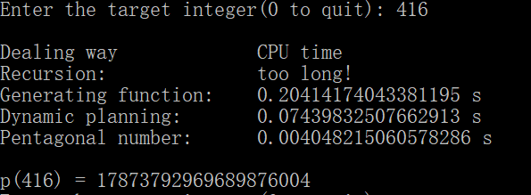
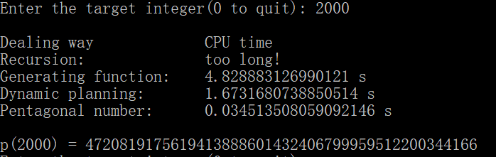
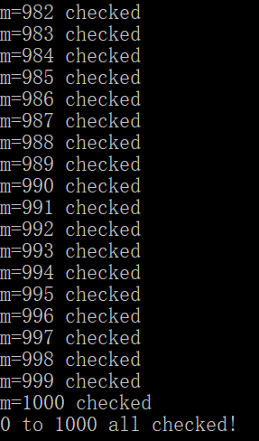

# integer_partition
组合数学作业：整数拆分

作者：张文喆 1551719

## 实现目标
输入一个数值x，输出x的拆分数p(x)

## 解题思路
拆分数的计算没有明晰的公式可以套用，通过查阅资料，我了解到具体的实现方法有：  
1. 递归法
2. 动态规划
3. 母函数法
4. 五边形数定理  

我只实现了这四个方法。

## 使用语言
Python  
这是考虑到Python优秀的科学计算能力。因为拆分数可能会很大，远远超出了C和C++中内置的整数类型的计数范围，如`p(2000) = 4720819175619413888601432406799959512200344166`，不利于进行处理；而Python则没有这样的麻烦。

## 算法设计

### 1. 递归方法
递归方法的核心是递归表达式。在这里我规定：  
1. n = m1 + m2 + m3 + ... + mi (mi为正整数，且1<=mi<=n)
2. max{m1, m2, m3, ..., mi} <= m  

则称{m1, m2, m3, ..., mi}为整数n的一个m划分，划分的个数记为q(n, m)。  
容易理解：p(x) = q(x, x)。  

对于q(n, m)，考虑以下事实：  
1. 当n = 1时，不论m取何值，都有q(1, m) = 1，即{1}
2. 当m = 1时，不论n取何值，都有q(n, 1) = 1，即{1, 1, ..., 1}(共n个1)
3. 当n < m时，由于划分中不可能出现负数，故q(n, m) = q(n, n)
4. 当n = m时，分为两种情况讨论：  
    a. 当划分中包括m时，则划分情况只可能为{m}  
    b. 当划分中不包括m时，此时的划分情况等价于n的一个(m-1)划分  
    所以，q(n, n) = 1 + q(n, n-1)
5. 当n > m时，同样分为两种情况讨论：
    a. 当划分中包括m时，则划分情况为{m, m1, m2, ..., mi}，且m1 + m2 + ... + mi = n - m，所以{m1, m2, ..., mi}相当于(n-m)的一个m划分，划分数为q(n-m, m)  
    b. 当划分中不包括m时，划分情况等价于n的一个(m-1)划分，划分数为q(n, m-1)  
    综上，q(n, m) = q(n-m, m) + q(n, m-1)

运用到递归过程中，可以这样设计：1和2是递归的返回条件；3可以合并到4中；4是5的一个特殊情况，但是如果将4和5合并，需要补充条件q(0, m)=1，所以在实践中并没有将4和5合并。最终表达式为：  
  

实际代码如下  
```python
def recursion_drive(self):
    """使用递归的方法找到拆分数，速度慢，占用栈空间大"""
    num = self.x
    return self.recursion(num, num)

def recursion(self, n, m):
    """具体的递归函数"""
    if n is 1 or m is 1:
        return 1
    elif n <= m:
        return self.recursion(n, n-1)+1
    else:
        return self.recursion(n, m-1)+self.recursion(n-m, m)
```

可以看到，递归是一种极慢的方法，对于P(x)=q的计算，它实际上进行了q次+1运算。

### 2. 动态规划
递归方法速度极慢，且占用大量栈空间，所以考虑使用动态规划的方法来优化时间和空间复杂度。这里面应用的仍然是递归表达式，只不过我们将计算q(n, n)过程中的计算结果保存起来，同时不再采用递归的倒序形式，而是从小到大计算出计算出q(i, j) (0 < i < n，0 < j < m)。  
设我们现在正在计算p(x)，那么为了实现动态规划的效果，我们需要维护一个x*x的表，在里面填写不同n和m下的q(n, m)。而动态规划节省时间的关键在于，当我们计算q(n, m)时，将其拆分为q(n-m, m) + q(n, m-1)，而q(n-m, m)和q(n, m-1)的值都已经记录在相应的位置上了，直接取用即可。最后我们返回q(n, n)的值作为p(x)。  
在实践中，略有些棘手的地方在于，数组(在Python中是List)的索引由0开始，所以在计算下标时不得不进行一些变换，在阅读代码时不免令人费解。

实际代码如下  
```python
def dynamic(self):
    """使用动态规划的方法找到拆分数，速度快，占用空间大"""
    num = self.x
    tablet = [[0 for m in range(num)] for n in range(num)] # 构建动态规划表格
    for n in range(num):
        for m in range(num):
            if n is 0 or m is 0:
                tablet[n][m] = 1
            elif n <= m:
                tablet[n][m] = tablet[n][n-1]+1
            else:
                tablet[n][m] = tablet[n][m-1]+tablet[n-m-1][m]
    return tablet[-1][-1]
```

由于在构建动态规划用到的表格时，需要开辟x*x的数组，所以占用内存空间比较大，但是避免了占用过多的栈空间。

### 3. 母函数法
动态规划可以视为递归方法的优化，其核心思想没有变化，而母函数方法是一种原理完全不同的方法，也是我们在组合数学课上学到的方法。  
考虑整数n的所有拆分中，所有的拆分得到的数字mi都小于等于n，而在每一组拆分中，m1 + m2 + m3 + ... + mi = n，所以可以使用母函数的方法来计算拆分数，具体方法如下：  
规定g(x, i)为i在x的拆分情况中的出现情况，而i出现k次表示为x^(i\*k),所以g(x, i) = 1 + x^i + x^(2i) + .. + x^(k\*i)，且n-i < k*i <= n，这表示i在拆分中出现0, 1, 2, ..., i次。  
所以G(x) = g(x, 1)g(x, 2)...g(x, n)  
展开后为：G(x) = a0 + a1x + a2x^2 + .. + anx^n + ...  
x^n代表一组数字的和为n，而我们的目标就是求出x^n的系数an，它就是n的拆分数p(n)，也即q(n, n)。这在程序中被转化为多项式乘法的问题。  
实现多项式乘法较为简单，我们只需要开辟两个长度为x的数组用于记录两组多项式的系数，然后逐位相乘，记录相乘的结果即可。在这个问题中，我们有n个多项式相乘，而且所有多项式中每一项的系数都为1，所以采用的方法是：先由g(x, 1)开始，将它记录在第一个数组中，数组中每一项都是1；然后将第一个数组中的每一项与g(x, 2)相乘，并将中间结果记录在第二个数组中，在完成两者相乘后将结果写入第一个数组。如此循环，直至n个多项式相乘完毕。

实际代码如下  
```python
def generating(self):
    """使用母函数的方法找到拆分数，速度快，占用空间小"""
    num = self.x
    # 两个多项式相乘，poly1存放最终结果，poly2存放中间结果
    poly1 = [1 for i in range(num+1)]  # 现在代表g(x, 1)
    poly2 = [0 for i in range(num+1)]
    for i in range(2, num+1): # g(x, i)中i的范围：[2, num]
        for j in range(num+1): # 遍历poly1中的每个项
            for k in range(0, num+1-j, i):
                # 对于poly1中给定的幂j，g(x, i)中提供的项的幂不得超过num-j
                poly2[k+j] += poly1[j] # 幂为k+j的项的系数增加1*poly1[j]
        poly1 = poly2 # 将poly2中的计算结果转存到poly1中
        poly2 = [0 for i in range(num+1)]
    return poly1[num]
```

母函数方法占用的空间较小，但是运行速度略微不如动态规划。

### 4. 五边形数定理  
为了使用这种方法，我们必须首先了解五边形数和欧拉函数。  
五边形数是能排成五边形的多边形数。第 n个五边形数可用以下公式求得：  
pn = (3n^2-n) / 2 , n > 0  
示意图如下：  
  

现在引入广义五边形数：允许n <= 0即可，公式保持不变。

又，五边形数被用于描述欧拉函数展开式的特性。欧拉函数展开如下：  
  
注意到展开式的最终结果，留下来的非零次项的幂即广义五边形数。

现在引入欧拉函数和分割函数(即p(n))的关系：由`3. 母函数`模块知，拆分函数的母函数恰为欧拉函数的`倒数`，具体推导过程省略。  
 

将其展开有：  
  

我们主要关心x^n项的系数。根据等号左右两边式子的关系，这个系数应为0，即：  
  

最终化为：  
  

得到这个递推关系式后，我们将其与动态规划的方法相结合，由p(1)一直计算到p(n)。

由此，我们借助欧拉函数作为桥梁，将广义五边形数与拆分函数联系了起来。这样做的好处在于：拆分数没有明晰的表达式，只有递推关系，这导致计算速度很慢；而广义五边形数有明确的计算公式，借助这个公式，我们拿到了p(n)的相对简洁得多的递推关系式，这大大减少了我们的计算量。

实际代码如下  
```python
def pentagonal_number(self):
    """使用五边形数定理计算拆分数，速度快，占用空间小"""
    num = self.x
    # 构建辅助数组
    assist = []
    for i in range(1, num):
        assist.append(int(i*(i*3-1)/2))
        assist.append(int(i*(i*3+1)/2))

    # 构建由1~num的拆分数列表
    p_list = [1, 1, 2]
    for i in range(3, num+1):
        count = 0
        p = 0
        for j in range(0, i):
            if assist[j] > i:
                break
            count %= 4
            if count is 0 or count is 1:
                p += p_list[i-assist[j]]
            else:
                p -= p_list[i-assist[j]]
            count += 1
        p_list.append(p)
        
    return p_list[num]
```

这种方法比纯动态规划的方法要快得多，它的时间复杂度为O(n^1.5)，而纯动态规划方法的时间复杂度为O(n^2)；并且它占用更小的空间，空间复杂度为O(n)，纯动态规划方法的空间复杂度为O(n^2)。具体对比可以参考下面x=3000时的运行速度。

## 结果分析
为了避免递归方法运行时间太长，阻塞程序，所以我规定，当x > 80时，不再执行递归方法。当x大于一定数值时，母函数方法也会变慢，所以当x > 2000时，不再执行母函数方法。当x > 3000时，不再执行动态规划方法。四种方法的运行效果如下，列表从上到下依此为递归方法、母函数方法、动态规划方法和五边形数定理方法：

### x = 10  


### x = 20  


### x = 80  


### x = 200  


### x = 416  


### x = 2000  


### x = 2001  


### x = 3000  


### x = 10000  


可以看到，随着x的增大，p(x)增长得越来越快。  
另外值得一提的是，为了保证四种方法得到的结果不会出现偏差，我对它们的结果进行了验证，保证其准确性：  
```python
for result in result_list:
    assert p4 == result, 'wrong answer!'
```
经过检验，并没有出现错误。

我在电影《知无涯者》中看到麦克马洪手算了前200个整数的拆分数，在观影时我并没有在意这个细节，但是知道我今天真的算出了p(200) = 3972999029388，我才意识到每个时代的数学家都有着自己的伟大之处。  
除此之外，据说拉玛努金发现，p(5m+4)可以被5整除，p(7m+5)可以被7整除，p(11m+6)可以被11整除，我对此进行了验证，发现至少对于我目前能够计算到的范围都是成立的。程序运行的部分截图如下：  
  
代码如下
```python
def main():
    for m in range(0, 101):
        p = pentagonal_number(5*m+4)
        assert p % 5 == 0, '5*{}+4 failed!'.format(m)
        p = pentagonal_number(7*m+5)
        assert p % 7 == 0, '7*{}+5 failed!'.format(m)
        p = pentagonal_number(11*m+6)
        assert p % 11 == 0, '11*{}+6 failed!'.format(m)

        print('m={} checked'.format(m))
    print('{} to {} all checked!'.format(0, 100))
```
向拉马努金、哈代和麦克马洪致敬。